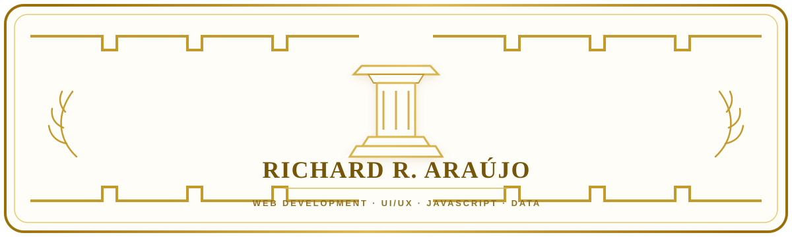
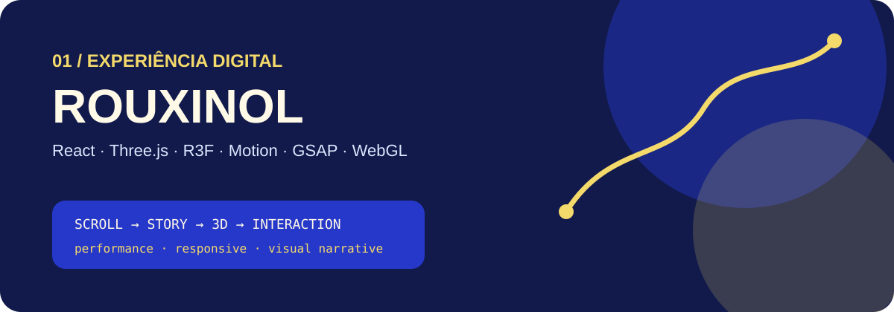
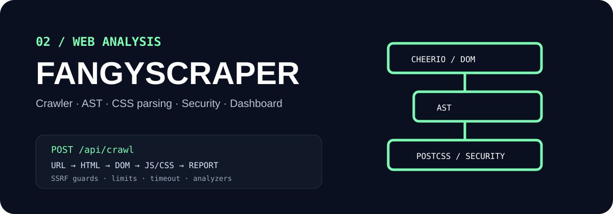
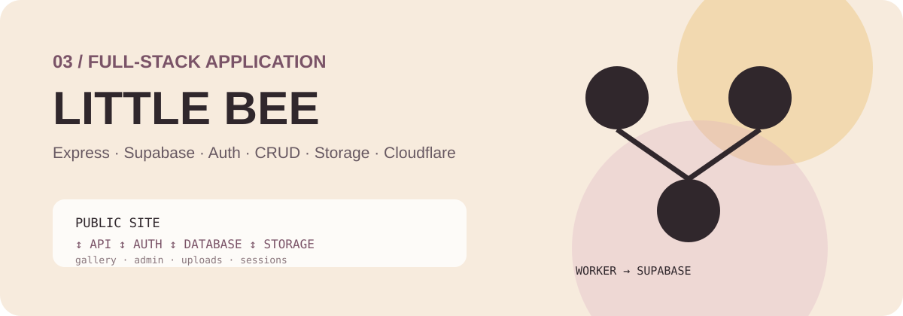
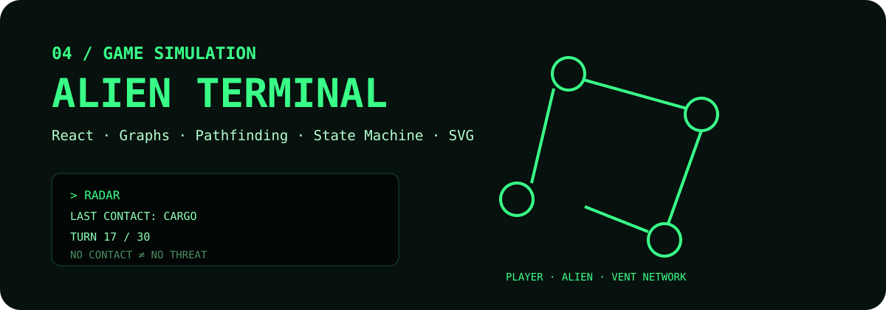
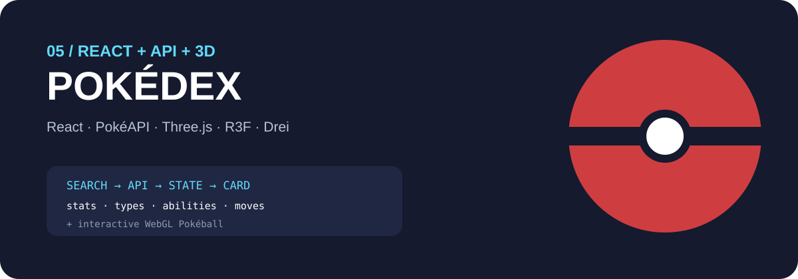

  

## 👋 Sobre mim

Estudante de **Análise e Desenvolvimento de Sistemas** e desenvolvedor em formação, com foco em **desenvolvimento web**.

Comecei pelo Front-End e fui expandindo para APIs, bancos de dados, autenticação, segurança, simulações e experiências 3D. Também tenho uma base em **UI/UX e design**, buscando unir código e experiência visual.

**Na prática:** HTML, CSS, JavaScript, React, Node.js, Express, SQL, Supabase, APIs REST, Git/GitHub, Cloudflare, Vercel e Three.js / React Three Fiber.

> React, Tailwind, Vue e parte do ecossistema 3D/motion ainda fazem parte do meu aprofundamento.

# 🏆 Projetos em destaque

Os cinco projetos abaixo representam diferentes partes da minha evolução técnica.

### 01 · Rouxinol

**Experiência digital comercial • React + 3D**

Projeto experimental de maior complexidade visual, combinando **React, Vite, Three.js, React Three Fiber, Drei, Motion, GSAP, HLS.js e WebGL**.

Modelos 3D, vídeo, scroll-driven interactions, rotas de modelos, componentes independentes e preocupação com performance.

---

### 02 · FangyScraper

**Web crawler • análise estática • segurança**

Ferramenta Node/Express que recebe uma URL e transforma HTML, CSS, JavaScript e recursos externos em um relatório técnico.

Usa **Cheerio, Acorn/acorn-walk, PostCSS e ipaddr.js**, com validação de URL, limites de recursos, timeout, proteções de rede e analisadores modulares.

---

### 03 · Little Bee — Arte & Pintura

**Full-stack • autenticação • CRUD • arquivos**

Aplicação com experiência pública e painel administrativo, construída com **Node.js, Express, Supabase, Multer, sessões, Helmet e rate limiting**.

Inclui autenticação, CRUD de pinturas, upload de imagens, Storage, banco de dados e integração com Cloudflare.

---

### 04 · Alien Terminal

**React • simulação • grafos • pathfinding**

Jogo de sobrevivência baseado em turnos, com mapa em grafo, movimentação do Alien, RADAR, perseguição, bloqueios, eventos e sistema de ventilação.

Construído com **React, Vite, JavaScript, Hooks e SVG**, com uma engine de regras separada da interface.

---

### 05 · Pokédex React

**React • API REST • 3D**

Aplicação que consome a **PokéAPI**, trabalha com componentização, props, hooks, loading/erro, estatísticas e tipos Pokémon.

Também possui uma **Pokébola 3D** usando Three.js, React Three Fiber e Drei.

---

## 🧩 Outros projetos

**BRASA** — landing editorial com vídeo, storytelling e scroll interactions.  
**CUT CLUB** — landing de barbearia com direção de arte e animações próprias.  
**Clínica Vita+** — CRUD, dashboard, métricas, gráficos e regras de negócio.  
**Portfólio pessoal** — HTML/CSS/JS + Three.js, WebGL, GLTF, SEO e acessibilidade.  
**Mayk VS Aliens** — Canvas, game loop, eventos, áudio e lógica de jogo.  
**Mitologias** — um dos primeiros projetos e um registro da evolução.

# 🛠️ Stack

  

| Área | Tecnologias |
|---|---|
| **Front-End** | HTML5 · CSS3 · JavaScript · React · Vite · UI/UX · Acessibilidade · SEO |
| **Back-End** | Node.js · Express · REST APIs · autenticação · CRUD · uploads |
| **Dados** | SQL · MySQL · PostgreSQL · SQLite · Supabase |
| **3D** | Three.js · React Three Fiber · Drei · WebGL · GLB/GLTF |
| **Deploy** | Git · GitHub · Cloudflare · Vercel · Render |
| **Design** | Figma · Photoshop · CorelDRAW · Canva |

## 📊 GitHub

  

  

## 🎓 Formação

**Análise e Desenvolvimento de Sistemas — Estácio** · 2026 — presente

**Certificações e cursos:**

* **freeCodeCamp — Responsive Web Design** · 300h
* **freeCodeCamp — Front End Development Libraries** · em progresso
* **Curso em Vídeo — MySQL** · 40h
* **RN Cursos — Design Gráfico** · 50h
* **DIO / Santander — Aceleração Santander: Cibersegurança do Zero à Prática**
* **DIO / Santander — Aceleração Santander: Boas Práticas de Segurança em Vibe Coding**
* **DIO — Segurança e Boas Práticas em Projetos Feitos com Vibe Code**

Atualmente aprofundando **React, JavaScript, Node.js, SQL, APIs, testes/homologação, performance, acessibilidade e experiências 3D para web**.

  
  

Construindo, testando, quebrando, entendendo e construindo de novo.

